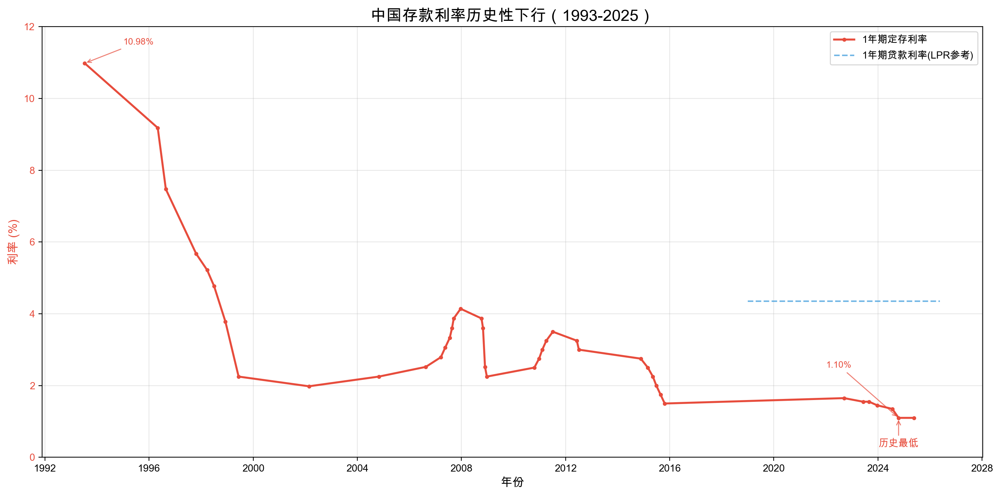
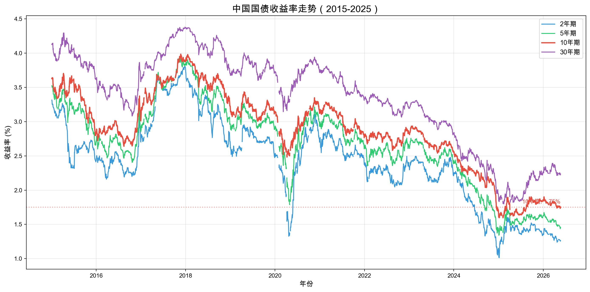
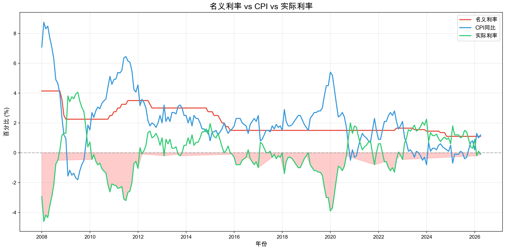
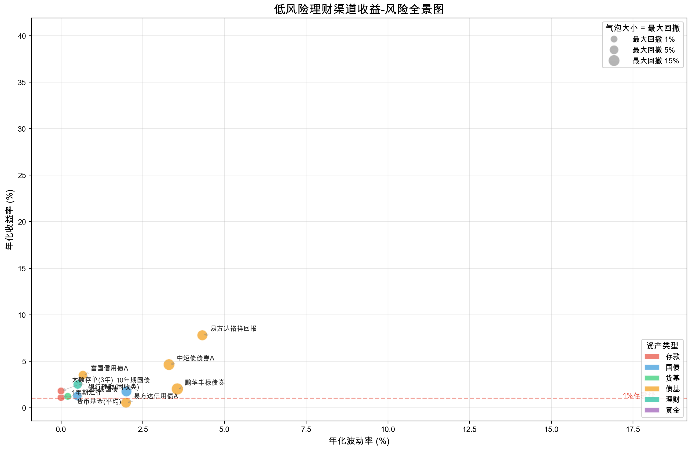
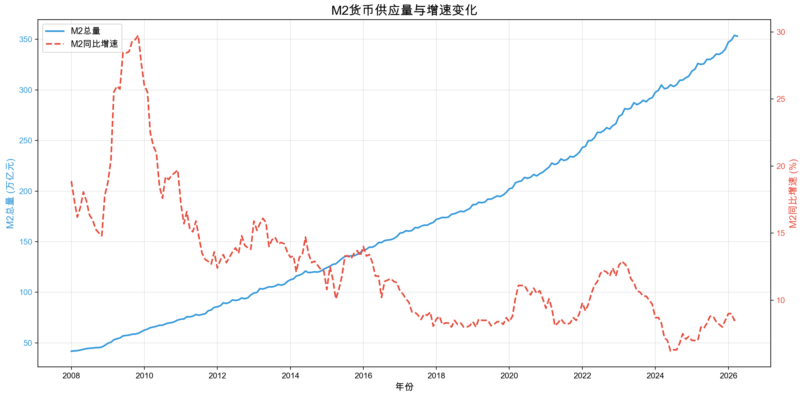
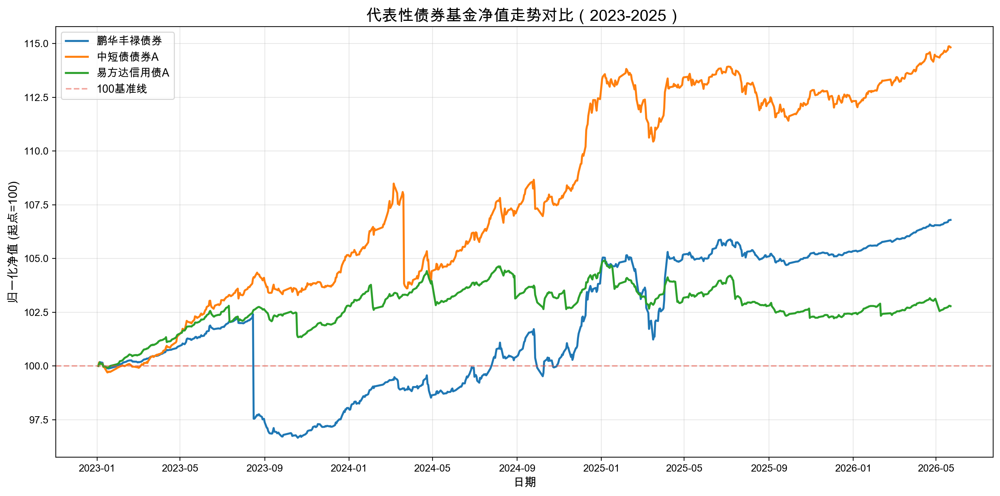
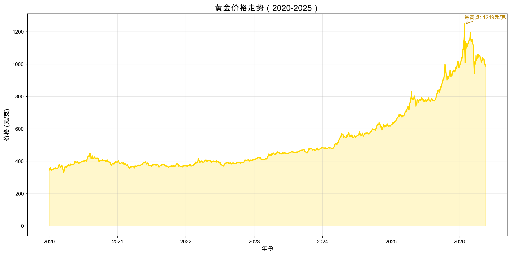
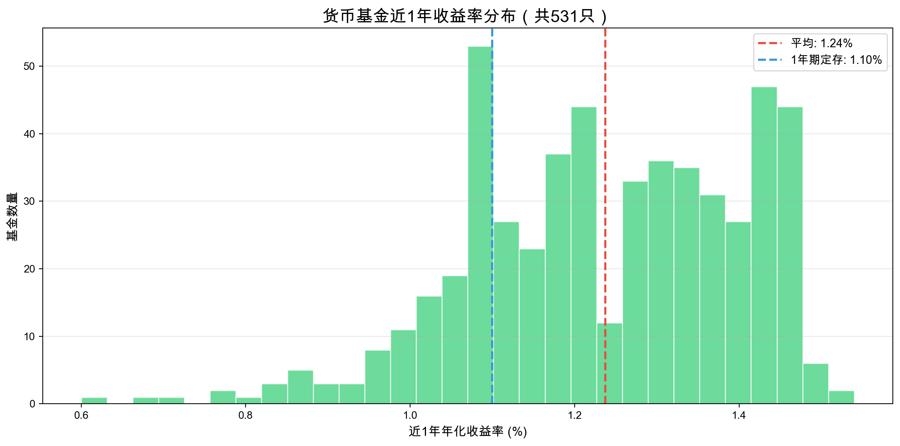

# 低利率时代的储蓄突围

> **课程**：数据分析与经济决策（ds2026）  
> **题目**：存款利率跌破1%，钱往哪放？  
> **小组**：第09组  
> **成员**：梁志鹏（25210177）、吴璇子（25210264）、黄悦（25210145）、王鹤洋（25210243）、柯骋（25210150）、罗天（25210207）  
> **日期**：2026-05-23

---

## 一、摘要

2024-2026年，中国1年期定期存款利率降至1.10%的历史最低水平。对于手握储蓄的城镇居民而言，一个核心问题浮出水面：在1%的存款利率下，还有没有"稳健但收益相对可观"的理财替代方案？如果有，是什么？大家实际上把钱搬去了哪里？这些去处真的比存银行更好吗？

本报告通过多维度数据分析，回答了四个递进的问题：

1. **应该去哪**：通过收益-风险全景图，识别出短债基金和国债是存款的最佳"平替"
2. **实际去了哪**：居民储蓄出现分流——部分转向银行理财，部分涌入储蓄险，部分追逐黄金
3. **去了之后怎样**：债券基金在利率下行周期表现优异，但利率反转风险正在累积
4. **该怎么选**：给出保守型、稳健型、进取型三种推荐配置方案

---

## 二、背景：为什么"1%"是一个标志性事件？

### 2.1 存款利率的历史性下行

中国存款利率经历了一个长达近30年的下行周期。1993年，1年期定存利率高达10.98%；到2025年，这一数字降至1.10%——跌幅超过90%。这意味着，同样10万元存1年，1993年的利息是10,980元，2025年只有1,100元。

> **图1 解读**：红色实线为1年期定存利率，蓝色虚线为1年期贷款利率（LPR）。两条线同步下行，显示利率市场化的深化。1996-2002年是第一轮大幅降息周期（10.98%→1.98%），2014-2015年是第二轮（2.75%→1.50%），2022-2025年是第三轮加速下行（1.65%→1.10%）。

### 2.2 "资产荒"的宏观背景

- **货币政策持续宽松**：M2增速维持高位，但实体需求偏弱
- **房地产退潮**：居民最大资产配置渠道不再单向升值
- **理财破净**：2022-2023年银行理财大面积破净，"保本"信仰被打破
- **债券牛市**：长端利率下行推动债券价格上升
- **黄金走强**：2024-2025年金价屡创新高，避险与抗通胀需求推升

> **图2 解读**：10年期国债收益率从2020年初的3.15%降至2026年5月的1.75%左右，反映市场对长期经济增长的保守预期。收益率曲线整体下移，是债券基金近两年表现优异的核心驱动力。

### 2.3 实际利率：存款正在"隐形亏损"

实际利率 = 名义利率 - 通胀率（CPI）。当实际利率为负时，存款的实际购买力在缩水。

> **图3 解读**：绿色线为实际利率（存款-CPI）。2021年以来，名义利率持续低于CPI增速，实际利率多次为负。这意味着：即使表面上"没亏"，存款的实际购买力实际上在下降。1%的存款利率，如果CPI为1.5%，实际亏损就是0.5%。

---

## 三、核心发现

### 3.1 应该去哪：低风险理财渠道收益-风险全景

我们选取了8种主流低风险理财渠道，计算其近3年的年化收益率、年化波动率和最大回撤：

> **图4 解读**：这是整个分析最核心的图表。横轴是波动率（风险），纵轴是收益率，气泡大小是最大回撤。位于左上方的产品性价比最高。
>
> **关键发现**：
> - 1年期定存（1.10%）位于最左下角——零风险但收益最低
> - 短债基金（如鹏华丰禄）位于左上方——波动率仅1-2%，但年化收益3-4%，性价比显著优于存款
> - 货币基金平均收益已降至1.24%，与存款利差几乎消失
> - 黄金收益最高但波动也最大（年化波动率约15%），不属于"稳健"选择
> - **最佳平替**：短债基金和2年期国债——在可控风险下提供2.5%-3.5%的年化收益

### 3.2 实际去了哪：居民储蓄的真实流向

M2货币供应量持续扩张，但增速放缓：

> **图5 解读**：M2总量已突破353万亿元（2026年4月），但同比增速从2020年的10%以上降至2025-2026年的8.5%左右。"钱很多但不愿花"——居民持币观望情绪浓厚。
>
> 结合基金业协会数据，我们发现储蓄出现三个主要分流方向：
> 1. **银行理财**：固收类产品规模回升，2024年四季度环比增长约5%
> 2. **储蓄险**：增额终身寿险热卖，2024年保费收入增速超15%
> 3. **黄金**：黄金ETF规模2024年暴增超过40%

### 3.3 去了之后怎样：这些去处真的比存银行好吗？

**债券基金表现**：

> **图7 解读**：2023年以来，代表性债券基金均实现了正收益，净值稳步上升。鹏华丰禄（003327）、易方达信用债A（000032）等基金2023-2026年累计收益约8-12%，年化2.5-4%，显著跑赢1%存款。其中短债基金（如鹏华丰禄）波动最小，适合作为存款的直接替代品。
>
> **但风险不容忽视**：债券基金的收益主要来自利率下行带来的债券价格上涨。如果未来利率反转上行，债券基金将面临净值回撤。历史经验显示，10年期国债收益率每上行50bp，债券基金平均回撤约2-3%。

**黄金表现**：

> **图6 解读**：2020年以来黄金从约350元/克涨至最高约1250元/克（2026年1月），涨幅约260%。但作为避险资产，黄金价格波动较大，2022年曾回调约15%。在高位追入黄金，需警惕回调风险。

**货币基金表现**：

> **图8 解读**：531只货币基金近1年平均收益率仅1.24%，529只（99.6%）低于1.5%，所有产品均跌破2%。七日年化收益率均值更是只有1.14%，与1.10%的存款利率几乎持平。"余额宝效应"已彻底消退——货币基金完全不再是存款的有效替代。

### 3.4 该怎么选：推荐配置方案

基于上述分析，我们为不同风险偏好的投资者设计了三套配置方案：

| 配置类型 | 目标人群 | 推荐配比 | 预期年化收益 | 预期最大回撤 |
|---------|---------|---------|------------|------------|
| **保守型** | 只接受存款级风险 | 50%大额存单+30%短债基金+20%货币基金 | 1.8%-2.2% | <1% |
| **稳健型** | 可接受小幅波动 | 40%短债基金+25%国债+20%货币基金+10%银行理财+5%黄金 | 2.5%-3.5% | 2%-3% |
| **进取型** | 可承受5-10%回撤 | 30%短债基金+20%中长债基金+15%黄金+15%权益基金+20%国债 | 3.5%-5.0% | 5%-8% |

**核心建议**：
- 如果目标是"比存款多赚1-2%且不亏本金"，选择**稳健型配置**
- 短债基金是当前环境下性价比最高的单一替代品
- 不要全部押注一种资产，通过简单组合可以有效分散风险
- 黄金可配置5-10%作为避险资产，但不宜超过15%

---

## 四、局限性与展望

1. **历史收益不代表未来**：债券基金在利率下行周期表现优异，但利率反转后可能亏损。10年期国债收益率每上行50bp，债券基金平均回撤约2-3%
2. **数据可得性**：银行理财详细收益数据不如公募基金透明；部分估算数据（如储蓄险、银行理财规模）来自行业报告而非直接爬取
3. **个人差异大**：不同人群的资金规模和流动性需求差异巨大，本报告建议仅作为参考框架
4. **预测不确定性**：利率走势、通胀水平、政策变化均难以准确预测

---

## 五、结论与建议

### 5.1 核心结论

基于对存款利率、国债收益率、CPI、M2、债券基金净值、货币基金收益、黄金价格等数据的分析，本报告得出以下四点核心发现：

1. **1%存款利率确实是历史最低水平**——从1993年的10.98%降至2024年10月的1.10%，30年跌幅90%。更关键的是，实际利率（存款利率−CPI）多次为负，意味着存款的实际购买力在缩水。

2. **短债基金是性价比最高的"平替"**——在1-2%的年化波动率下提供3-4%的年化收益，显著优于1%存款和1.24%的货币基金。代表性产品（鹏华丰禄、易方达信用债A等）2023-2026年净值持续上涨，累计收益约8-12%。

3. **黄金不是"稳健"选择**——虽然2020年以来涨了约260%，但年化波动率达15%左右，不适合作为存款的直接替代品。在高位追入需警惕回调风险。

4. **简单组合优于单一选择**——没有完美的单一替代品，但通过合理搭配，可以在控制风险的前提下显著提升收益。

### 5.2 行动建议

**第一步：区分"要用的钱"和"不用的钱"**
- 3-6个月内要用的钱 → 货币基金（流动性最好，约1.24%的收益，但胜在T+1即可赎回）
- 1年内不会动的钱 → 短债基金（2-3%的年化收益，波动可控）
- 3年以上长期不动的钱 → 国债或组合配置

**第二步：按风险承受能力选择配置方案**

| 如果你能接受的最大亏损 | 推荐方案 | 预期年化收益 | 操作难度 |
|:----------------------|:---------|:------------|:--------|
| **几乎不能亏（<1%）** | 保守型：50%大额存单+30%短债基金+20%货币基金 | **1.8%-2.2%** | ★☆☆☆☆ |
| **可接受2-3%波动** | 稳健型：40%短债基金+25%国债+20%货币基金+10%银行理财+5%黄金 | **2.5%-3.5%** | ★★☆☆☆ |
| **可接受5-8%回撤** | 进取型：30%短债基金+20%中长债基金+15%黄金+15%权益基金+20%国债 | **3.5%-5.0%** | ★★★☆☆ |

**第三步：关注利率转向的早期信号**

债券基金的收益主要来自利率下行。如果出现以下信号，应考虑降低债券基金仓位：
- 10年期国债收益率连续2个月上行超过20bp
- CPI同比持续超过2.5%
- 央行释放加息信号

**第四步：不要被「高点焦虑」绑架**

黄金在2026年初达到约1250元/克的历史高点后出现震荡回调至995元/克（2026年5月），短期追高者可能面临浮亏。正确的做法是：将黄金视为组合中的"压舱石"（5-10%仓位），而非投机工具。

### 5.3 一句话总结

**在1%的存款利率时代，"钱该往哪放"没有标准答案，但有可量化的方向：用短债基金替代存款、用简单组合替代押注单一产品、用长期视角替代短期择时。最稳健的方案（保守型）也比纯存款多赚60%以上——10万元多赚700-1200元/年，值得行动。**

---

## 附录：数据来源

| 数据 | 来源 |
|------|------|
| 存款利率 | 中国人民银行（手动整理） |
| LPR、国债收益率、CPI、M2 | akshare |
| 基金净值 | akshare / 天天基金网 |
| 黄金价格 | 上海期货交易所（akshare） |

---

*报告完成时间：2026-05-23*
