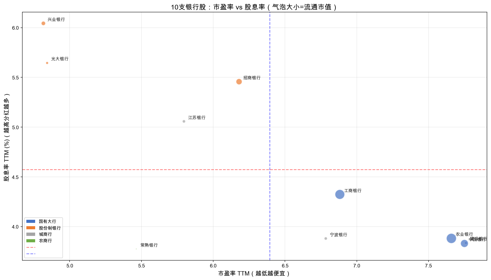
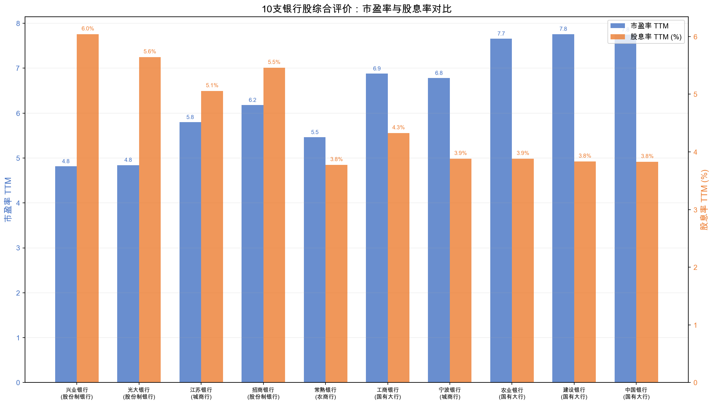
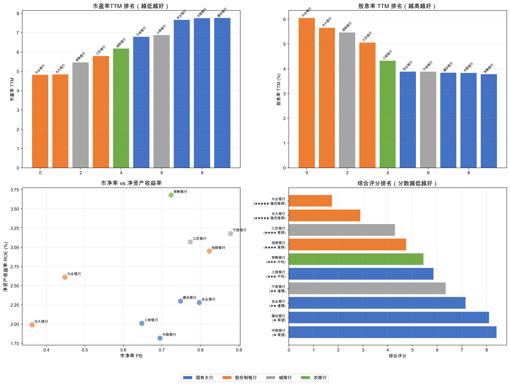
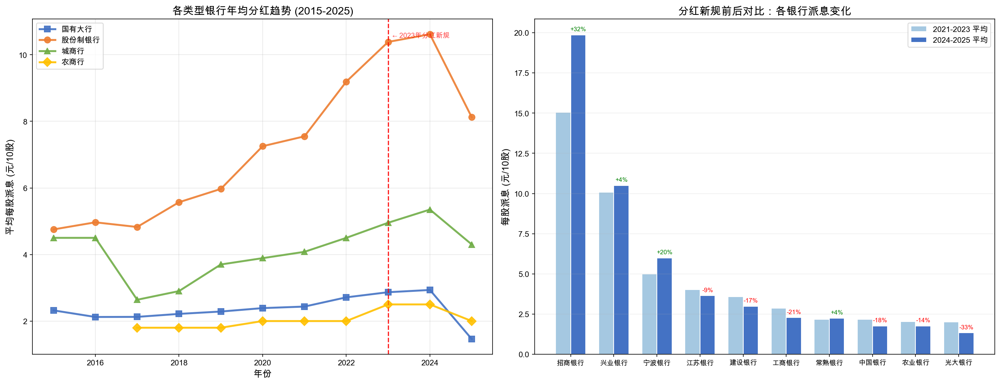

<!-- _class: lead -->
# 银行股投资价值分析
## 基于市盈率与分红率的选股研究

**ds2026 · 第二次小组作业**
2026-05-25

---

<!-- _class: lead -->
## 我们在帮谁解决什么问题

---

### 决策场景

A 股 38 家上市银行，总市值超 12 万亿元。个人投资者面临的核心困惑：

| 决策场景 | 投资者的困惑 |
|---------|------------|
| **选股决策** | 国有大行、股份制、城商行、农商行——哪类性价比最高？ |
| **估值判断** | PE 4-8 倍，是"便宜"还是"价值陷阱"？ |
| **回报预期** | 股息率 3%-7%，哪些是真正的现金回报？ |

### 本报告回答四个问题

1. 谁的 PE 最低？谁的股息率最高？
2. 不同类型银行有显著差异吗？
3. 2023 年分红新规后发生了什么变化？
4. 当前时点，哪些银行股最具投资价值？

---

## 政策背景：2023 年分红新规

---

### 核心政策文件

**《上市公司监管指引第 3 号——上市公司现金分红（2023 年修订）》**

证监会 · 2023 年 12 月 15 日发布

> "上市公司最近三个会计年度累计现金分红总额低于年均可分配利润的 30% 的，证监会派出机构应当对公司进行**约谈**。"

**配套升级**（2024 年 3 月）：
> 对多年不分红或分红比例偏低的公司，实施 **ST 风险警示**。

---

### 银行板块在 A 股分红中的地位

| 统计事实 | 数据 |
|---------|------|
| A 股现金分红背景 | 2024 年度分红总额保持在万亿元以上 |
| 本报告样本 | 10 家代表性上市银行均有近年现金分红记录 |
| 样本平均股息率 | **4.55%** |
| 样本平均市净率 | **0.68 倍**（整体破净，存在资产质量折价） |

> 银行股同时具有高股息、低估值和资产质量折价三重特征——这正是我们分析的价值所在。

---

## 数据来源与分析方法

---

### 数据来源

使用 **AKShare** 开源金融数据库，三个核心接口：

| 接口 | 数据内容 | 来源 |
|------|---------|------|
| `stock_individual_spot_xq()` | PE、PB、股息率、股价 | 雪球 |
| `stock_history_dividend_detail()` | 历年分红记录 | 东方财富 |
| `stock_financial_analysis_indicator()` | ROE、股息发放率 | 东方财富 |

### 选股范围

10 支代表性银行，覆盖四大类型：国有大行（4）、股份制（3）、城商行（2）、农商行（1）

### 综合评分方法

PE 排名（35%）+ 股息率排名（35%）+ PB 排名（15%）+ ROE 排名（15%）

---

## 核心图表 1：PE vs 股息率

**左下角 = 最优区间**：低 PE + 高股息率。兴业银行、光大银行明显领先。

---

## 核心图表 2：综合排名对比

**蓝色 = PE（低好），橙色 = 股息率（高好）**。国有大行 PE 显著高于股份制银行，股息率反而更低。

---

## 核心图表 3：多维度分析

**四维对比**：PE、股息率、PB×ROE、综合评分。股份制银行在"性价比"维度上全面领先。

---

## 核心图表 4：分红新规前后的趋势变化

**新规后出现明显分化**：招商银行 +32%、宁波银行 +20% 主动"抢跑"；部分大行分红反降。

---

## 分组对比：不同类型的巨大差异

| 类型 | 平均 PE | 平均股息率 | 平均 PB | 平均 ROE |
|------|:-------:|:---------:|:-------:|:--------:|
| **股份制银行** | **5.15** | **5.72%** | **0.54** | 2.52% |
| 城商行 | 6.29 | 4.47% | 0.83 | 3.13% |
| 农商行 | 5.46 | 3.78% | 0.72 | 3.68% |
| 国有大行 | 7.52 | 3.97% | 0.70 | 2.10% |

**反直觉发现**：国有大行"大而不倒"的安全性已被市场定价，PE 反而最高、股息率反而最低。

---

## 结论：投资价值排名

| 评级 | 股票 | PE | 股息率 | 核心理由 |
|:----:|------|:---:|:------:|---------|
| ★★★★★ | **兴业银行** | 4.82 | 6.04% | PE 最低 + 股息率最高 + PB 极低 |
| ★★★★★ | **光大银行** | 4.84 | 5.65% | PB 仅 0.36，安全边际极大 |
| ★★★★ | **江苏银行** | 5.80 | 5.06% | 城商行中成长与分红兼顾 |
| ★★★★ | **招商银行** | 6.18 | 5.46% | 零售之王，分红额行业第一 |
| ★★★ | 工商银行 | 6.88 | 4.32% | 绝对安全但性价比一般 |
| ★ | 中国银行 | 7.75 | 3.83% | PE 偏高、ROE 最低 |

---

### 对投资者的建议

| 投资风格 | 推荐标的 | 关注指标 |
|---------|---------|---------|
| 深度价值（捡烟蒂） | **光大银行** | PB 0.36 |
| 红利复利 | **兴业银行** | 股息率 6.04% |
| 成长价值（GARP） | **江苏银行** | ROE 3.07% |
| 稳健蓝筹 | **招商银行** | 零售护城河 |

**核心认知**：
- 高股息率 + 低 PE ≠ 一定好，前提是分红有盈利能力支撑
- 国有大行的"安全溢价"已被定价，性价比反而不如股份制银行
- 分红新规加速了银行间分化：好银行主动多分，差银行想分也没钱

---

## 局限性与展望

### 本报告的局限

- 仅使用 PE/股息率/PB/ROE 四指标，未纳入不良贷款率、拨备覆盖率等银行核心风险指标
- 静态分析（TTM 数据），未做盈利预测
- 低 PE 不必然意味着股价会"价值回归"，银行股低估值有结构性原因

### 后续可做的加分项分析

- 回归分析：量化 PE、股息率对银行股未来收益率的预测力
- 引入不良率、资本充足率等风险指标，构建更全面的评分模型
- 事件研究：精确测量 2023 年分红新规发布前后银行股的超额收益

---

<!-- _class: lead -->
# 谢谢！

**ds2026 · 第二次小组作业**
数据来源：AKShare · 2026-05-25
